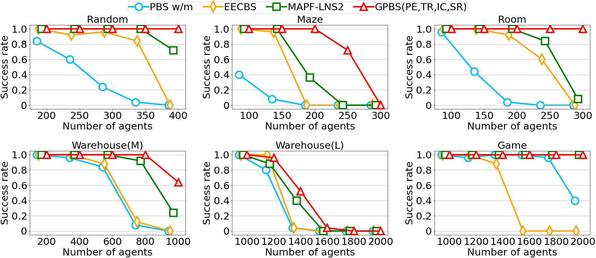
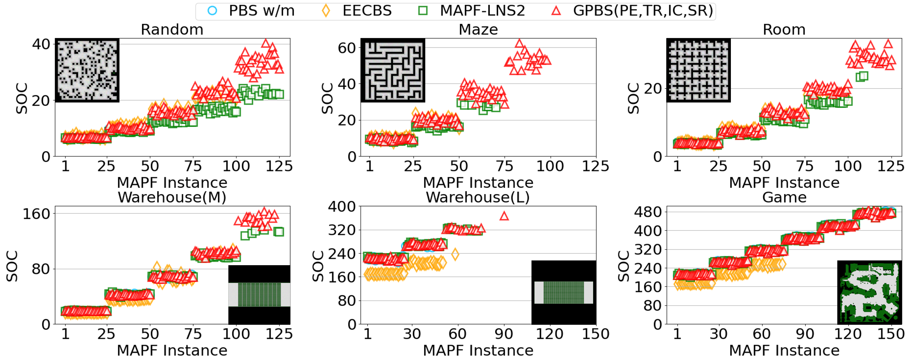

# Greedy Priority-Based Search (GPBS)
[](https://github.com/shchan13/PBS/actions/workflows/test_ubuntu.yml)

This repo is the implementation of our [paper](https://ojs.aaai.org/index.php/SOCS/article/view/27278) at SOCS 2023 [1].
The empirical results show that GPBS outperforms than SOTA in terms of success rates within 60 seconds with good-quality solutions.





Priority-Based Search (PBS) [2] is an efficient suboptimal algorithm for solving Multi-Agent Path Finding (MAPF).
On top of that, we propose **Greedy PBS (GPBS)** with other improved techniques that aims to minimize the number of collisions during the search. We also implement four enhancements to speed up the search: Partial Expansion (PE), Target Reasoning (TR), Induced Constraints (IC), and Soft Restart (SR).
This repo also provides a SIPP option that uses SIPPS [3] (instead of space-time A*) on the low level to plan paths for agents.

## Usage
The code requires the external library [boost](https://www.boost.org/).
If you are using Ubantu, you can install it simply by
```shell script
sudo apt install libboost-all-dev
``` 
Another easy way of installing the boost library is to install anaconda/miniconda and then
```shell script
conda install -c anaconda libboost
```
which works for a variety of [systems](https://anaconda.org/anaconda/libboost)
(including linux, osx, and win).

If neither of the above method works, you can also follow the instructions
on the [boost](https://www.boost.org/) website and install it manually.


After you installed boost and downloaded the source code, go into the directory of the source code and compile it with CMake:
```shell script
mkdir build && ccd build
cmake -DCMAKE_BUILD_TYPE=RELEASE ..
make
```

Then, you are able to run the code:
```shell script
./pbs -m random-32-32-20.map -a random-32-32-20-random-1.scen -k 400 -t 60 -o test.csv --outputPaths paths.txt --outputConf conflict.txt --solver GPBS --tr true --ic true --rr true --rth 0
```

- m: the map file from the MAPF benchmark
- a: the scenario file from the MAPF benchmark
- k: the number of agents
- t: the runtime limit
- solver: which solver to use (our GPBS already contains partial expansion)
- tr: whether to use target reasoning (only for GPBS, *default:True*)
- ic: whether to use induced constraint maximizations (only for GPBS, *default:True*)
- rr: whether to use soft restart (only for GPBS, *default:True*)
- rth: the number of backtracking we allow before restart (only valid if `rr` is set true, *default:True*)
- o: the output file that contains the search statistics
- outputPaths: the path to store the paths of the solution.

You can find more details and explanations for all parameters with:
```shell script
./pbs --help
```

To test the code on more instances,
you can download the MAPF instances from the [MAPF benchmark](https://movingai.com/benchmarks/mapf/index.html).
In particular, the format of the scen files is explained [here](https://movingai.com/benchmarks/formats.html).
For a given number of agents k, the first k rows of the scen file are used to generate the k pairs of start and target locations.

## License
GPBS is released under USC – Research License. See license.md for further details.
 
## References
[1] **Shao-Hung Chan**, Roni Stern, Ariel Felner, and Sven Koenig.
Greedy Priority-Based Search for Suboptimal Multi-Agent Path Finding.
In Proceedings of the International Symposium on Combinatorial Search (SOCS), pp. 11-19, 2023.

[2] Hang Ma, Daniel Harabor, Peter J. Stuckey, Jiaoyang Li and Sven Koenig. 
Searching with Consistent Prioritization for Multi-Agent Path Finding. 
In Proceedings of the AAAI Conference on Artificial Intelligence (AAAI), pp. 7643-7650, 2019.

[3] Jiaoyang Li, Zhe Chen, Daniel Harabor, Peter J. Stuckey and Sven Koenig.
MAPF-LNS2: Fast Repairing for Multi-Agent Path Finding via Large Neighborhood Search
In Proceedings of the AAAI Conference on Artificial Intelligence (AAAI), pp. 10256-10265, 2022.
